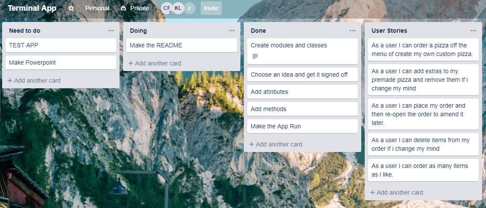

# Terminal App: Pizza Cake version 1.0
<!-- Pizza Shop point of sale app running in the Bash command line written in Ruby. -->

## Contributors
|[] https://github.com/The4Star| 
[] https://github.com/klps007|
|-----------|-----------|
| Clinton Forster | Kristy Lake |

### Link
https://github.com/The4star/pizza_cake

### Purpose
Made for potentional sale to Pizza Shops, "Pizza Cake" provides a quick and simple process for making, placing and storing multiple orders which can also be ammended after an order has been placed. Within Pizza Cake's current scope as a minimum viable product, its primary purpose for the user is a simple process for  ordering a premade pizza, building a custom pizza, ordering drinks,amending an order, placing the order and storing the order should it need to be recalled in the future.
 
#### Functionality

Based on user input, Pizza Cake will return the users order itemized including cost per item and total order cost.

Pizza Cake users can build there own pizza by selecting size, base type and adding their chosen toppings, this returns an updated total order cost and the items in the current order (updated after each selection).

Alternatively, users can select a premade pizza and add any additional toppings required.

Throughout the session users can review their order and the total cost at the top of the screen and have option to delete the last item added to the order.

### Dependencies
The only Ruby Gem used was Artii for the title, all the rest of the code has been written by the team. 


### Instructions for Use
To run Pizza Cake you will need to install Artii. To do this, enter the following into terminal: 

```ruby
$ gem install artii
``` 

Open Terminal or preferred console. To initialise program, locate the src folder and call: 

```ruby
$ ruby app.rb
```

Pizza cake will open and you are ready to start making orders! 

From the main menu, make a selection:


You can then Create an order, all functions are controlled by numeric choice and prompt the user to enter a valid selection if they have make a wrong choice: 

Creating an order name


Selecting what you want to order.


Selecting a base. 


Selecting a size. 


Selecting Extras. 


Adding a drink. 


Deleting an item.


Placing an order.


The user can also access and ammend previous orders:

Ammending an order.


## Designing and Planning
### Brainstorming
Initial planning was carried out on paper as well as a user workflow drawn up in Microsoft Word.


### Task Management
Trello was used in a minimalist way to designate tasks and to keep us on task as we worked through  making the program.



### User Journey/Workflow
A workflow was drawn up to help us know exactly how the app would run which made it alot easier to then make the program:


### Project Plan & Timeline
The scope for Pizza Cake v1.0 initial build was two days. After planning and making up our workflow we then set about writing the code and testing the code until we were happy with the minimum viable product. We then created the readme file and a presentation for when we sell the product as well as testing the product to make sure our code was working according to the way we had planned.   

### Coding Process
1. We created the file system 
2. Seperate files were created and modules were made
3. Classes were added in the modules with attributes
4. Methods were added in the classes
5. Constants were added in the module
6. The main functioning/workflow of the app was coded
7. Stretch goals (storing orders for later use and ammending the orders) were coded

### Testing the app
The following tests were peformed:

| test num | test method name | inputs | expected result | actual result |
| ------------ | ------------ | ------------ | ------------- | ------------- |
| *1* | *test_choose_a_drink* | *customerorder*  | *The method wll ask for a valid selection as the user did not enter an integer between 1 and 6* | *please make a valid selection*
| *2* | *test_main_menu* | *none* |*The method will change to the customer_name method because the user has selected option 1*|*Pass*|
| *3* | *test_remove_item* | *customerorder* |*The method will remove the last drink from the drinks_ordered array and remove the cost of the drink from the order_total*| Pass |

### Why Certain Data Types Were Used
* We used modules in seperate files so that we were able to seperate the different items that a customer was able to order so that the main workflow of the app would be neater and more readable. 
* Case statements were used to shorten the amount of code required to write menues
* All objects were stored in Arrays within the modules that were constants again so that the main workflow of the app was neater and that all the different aspects of the classes and objects were kept in the one easy to read file. 

### Societal impact of the app
Pizza Cake is in no way meant to cause offence or harm to the user. There are multiple different choices for food for different allergies from Gluten Free bases to Vegetarian options and the ability to customize a pizza from scratch if no suitable premade options are available. Notes can also be left on the order in case of the user needing to let the pizza shop know anything. 

The only other things we can think of is translating the app into multiple languages which would require a third party and alot longer than the two day timeframe. 

### Challenges
* Accessing objects within modules
* Making sure the app would continue to run unless the user chooses to exit 
* storing orders for later reference
* accessing orders so that you are able to ammend them.

### Future Enhancements
* Staff login
* Reporting features
* Access order history from previous days
* Cash out function
* Choose Delivery, pickup or dine in 
* If dine in be able to assign orders to a table
* Allow the end user to change pricing of products
* Many more